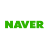

# Markdown
    마크다운(Markdown)은 마크업 언어의 일종.
    되도록 읽고 쓰기 쉽게 간단하게 만들었다.
    sns의 `태그` 기능도 하나의 마크다운이다.
# 문법정리

## **1. 헤더 Header**
    # h1
    ## h2
    ### h3
    #### h4
    ##### h5
    ###### h6

# h1
## h2
### h3
#### h4
##### h5
###### h6  

## **2. 목록 List**
순서 없음(*, +, -)

    * 순
        * 서
            + 없
                - 음
    
* 순
    * 서
        + 없
            - 음


순서 있음  

숫자를 쓰고 점만 찍으면 순서대로 쓰지 않아도 알아서 내림차순 적용

    1. 1
    1. 2
    2. 3
    3. 4
        1. 4-1 
    

1. 1
1. 2
2. 3
3. 4
    1. 4-1

## **3. 줄바꿈**
\<br> 이나 띄어쓰기 2번으로 바꿀 수 있다.

    마크다운
    <br>
    줄바꾸기  어렵다


마크다운
<br>
줄바꾸기  
어렵다

<br>

한칸 띄우는 법은 띄어쓰기 2번에 엔터로 줄바꿈 해주면 해결

    마크다운  

    줄 띄우기

마크다운  

줄 띄우기

## **4. 수평선**

```
***
---
___
```
***
---
___

## **5. 강조**
```
*기울이기*
_기울이기_
**굵게**
__굵게__
~~취소선~~
_**중복도 이용 가능합니다**_
```
*기울이기*  
_기울이기_  
**굵게**  
__굵게__  
~~취소선~~
_**중복도 이용 가능합니다**_  

## **6. 인용**
```
> 인용
>> 이뇽
>>> 이인뇨옹
```
> 인용
>> 이뇽
>>> 이인뇨옹

## **7. 링크**
일반적인 링크
```
일반적인 링크
[네이버](www.naver.com "네이버")
```
같은 글 앵커 활용  
[보여지는 내용](#이동할 헤드(제목))  
괄호 안에 띄어쓰기는 -로 바꾸고 영어는 모두 소문자로 변경
```
[링크](#7-링크)
```
[네이버](http://www.naver.com "네이버")  

[링크](#7-링크)

## **8. 이미지**
링크와 비슷하지만 앞에 느낌표 `!`가 붙는다.
```

```


## **9. 이미지 링크**
링크와 이미지를 섞어서 쓰면 된다.
```
[](http://www.naver.com)
```
[](http://www.naver.com)


## **10. 코드블록**
블록 형식으로 코드나 글을 표기 할 수 있다.  
방법은 3가지가 있다.  

    ```
    역따옴표(grave)
    ```

    ~~~
    물결
    ~~~

        텝(tap)

```
역따옴표(grave)
```

~~~
물결
~~~

    텝(tap)

## **11. 이모지**
이모지 검색   
https://www.webfx.com/tools/emoji-cheat-sheet/  

```
:사용할 이모지 넣기:
:smile:
:smile:
```  
:smile:  
:smile:  

