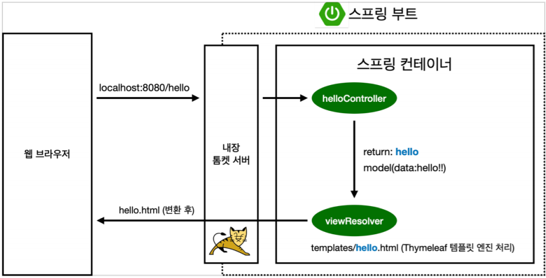
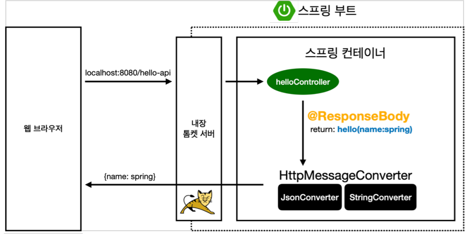

# 스프링 동작 환경
  
* Spring Web에서 MVC 구조가 돌아가는 방식이다.
* 스프링 부트에서는 톰캣이 내장되어 있다. 브라우저에서 요청이 오면 톰켓 서버를 거치고 우선적으로 Controller를 거쳐간다. MVC 모델에서 C에 해당한다.
* model에 data를 담아준다.
* 컨트롤러에서 리턴 값으로 문자를 반환하면 `viewResolver`가 화면을 찾아서 처리한다.
* 스프링 부트 템플릿엔진 기본 viewName 매핑이 가능하다. templates에 들어있는 html을 읽는다.
```
resources:templates/ +{ViewName}+ .html
```
# 정적 컨텐츠

* 서버에서 동작 없이 파일 그대로 웹 브라우저에 내려주는 방식.

# MVC와 템플릿 엔진

* 서버에서 변형을 해서 html을 바꿔서 내려주는 방식.
```Java

    @GetMapping("address")
    public String helloMvc(@RequestParam("name") String name, Model model){
        model.addAttribute("name", name);
        return "문자열";
    }
```
* @GetMapping은 HTTP Get 요청을 받는다.
* @GetMapping = @RequestMapping(method = RequestMethod.GET, path="/address")
* address는 브라우저 주소창에 들어가는 주소이다.
* @RequestParam("name")은 넘어오는 단일 HTTP 파라미터 요청 값 중에 "name"을 말한다.
* 뒤에 String name은 넘어온 파라메터 값의 속성을 변환한다.
* return 값에 "문자열"을 넣으면 스프링 부트에서 resources/templates 안에 있는 `문자열.html` 파일을 자동으로 읽어온다.
* 읽어오면서 View로 보내기 전에 문자열을 반환해줬기 때문에 `viewResolver`가 처리하게 되고 거기에서 Thymeleaf 템플릿 엔진을 처리한다. 그리고 변환된 html을 웹에 보낸다.


# API

* 요즘은 json 데이터 구조 포맷으로 데이터를 전달하는 방식. 객체를 반환하는 것.
```Java
 @GetMapping("hello-api")
 @ResponseBody
 public Hello helloApi(@RequestParam("name") String name) {
    Hello hello = new Hello();
    hello.setName(name);
    return hello;
 }
 static class Hello {
    private String name;
    public String getName() {
    return name;
    }
    public void setName(String name) {
    this.name = name;
    }
 }
```
* 웹 브라우저에서 요청값(URL)이 톰켓을 거쳐 컨트롤러에 도달했는데 `@ResponseBody`를 만나면 스프링은 템플릿과 다르게 그대로 값을 넘기려고 한다. 
* 템플릿은 viewResolver가 처리 했다면, API는 Responsebody를 만남과 동시에 HttpMessageConverter가 처리한다.
* HttpMessageConverter가 처리하는 값이 단순 문자면 StringConverter(StringHttpMessageConverter)가, 객체면 JsonConverter(MappingJackson2HttpMessageConverter)가 JSON 형식으로 바꿔준다.
* 스프링에선 범용성을 위해 라이브러리 선택을 MappingJackson2HttpMessageConverter을 했다.
* 구글에선 다른 라이브러리, Gson을 쓴다.
* 어노텐션 @ResponseBody를 붙이고 return에 객체를 반환하면 자동으로 JSON으로 변환된다.
* byte 처리 등 기타 여러가지 HttpMessageConverter가 기본으로 등록되어있다.
* json 자체를 그대로 전해주기 때문에 소스보기를 보면 html 태그 같은 것들이 없다.